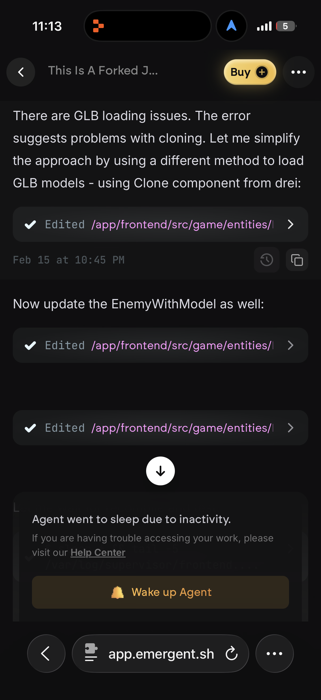
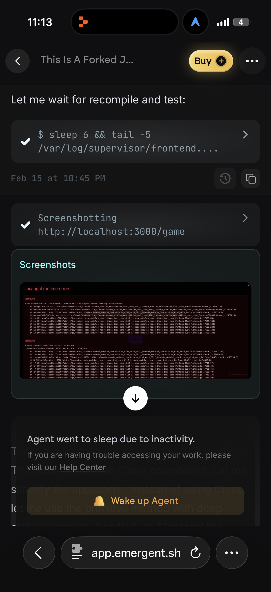
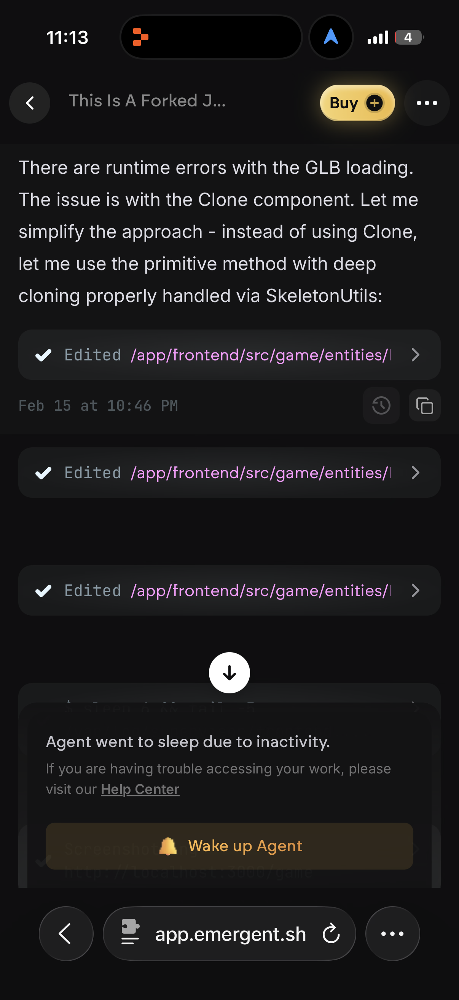
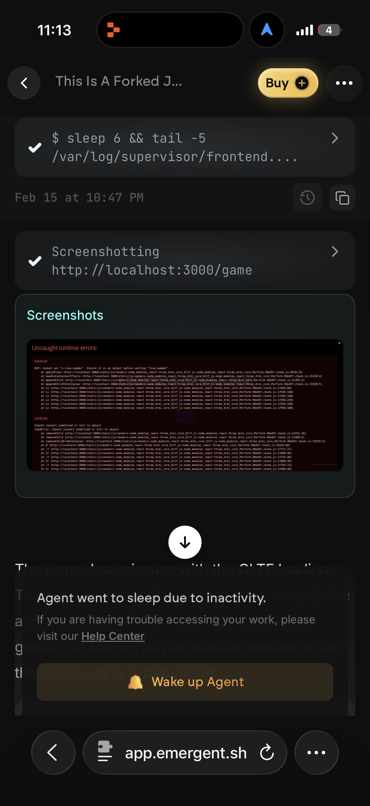
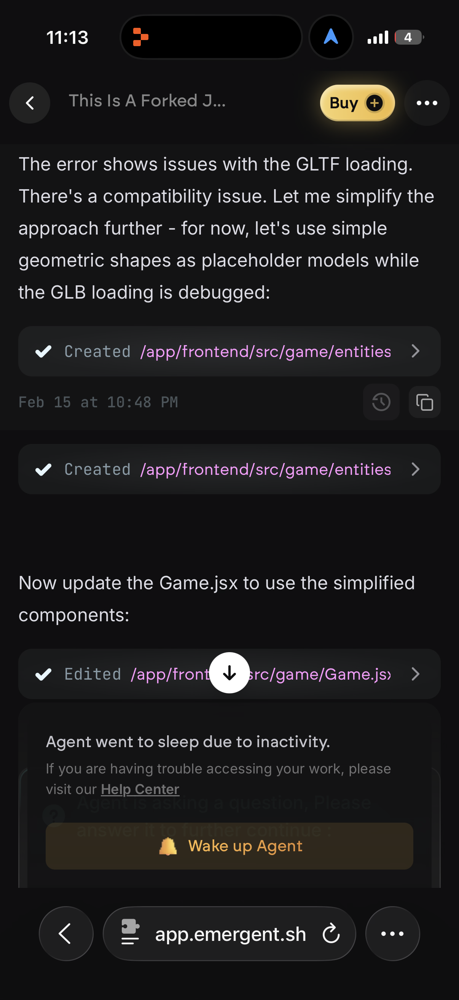

# Legends of Kai-Jax: The Memory King

**Status:** PRODUCTION CANON LOCKED
**Version:** 1.0.0

## Project Summary

**Legends of Kai-Jax** is an action-adventure open world game prototype featuring hybrid sabertooth heroes in a mythic megacity. Play as Kai-Jax, the Memory King, a fused sabertooth warrior who must harness the power of nine elemental tails to defend against ancient threats. Experience fast-paced combat, dynamic movement, and wave-based arena battles in a fully 3D browser-based game.

---

## Engine & Tech Stack

- **Three.js** - 3D rendering and graphics engine
- **React Three Fiber** - React renderer for Three.js
- **TypeScript** - Type-safe game logic and systems
- **Vite** - Fast build tooling and development server
- **Zustand** - State management for game systems
- **Custom Physics** - Velocity-based movement and collision detection
- **React** - Component-based UI architecture

---

## Gameplay Features

### Combat System
- **Frame-perfect fighting mechanics** with startup, active, recovery, and cancel windows
- **Combo system** supporting up to 3-hit chains with chainable attack windows
- **Multiple attack types:** Light attacks (6-7 frame startup), Heavy attacks (10 frame startup with super armor), Skill attacks (8 frame startup)
- **Stamina management** system with 100 max stamina, regeneration, and exhaustion thresholds
- **Dodge mechanics** with 16 invincibility frames and distance-based evasion
- **Combat states:** FREE, ATTACKING, DODGING, HITSTUN, BLOCKING
- **Synergy meter** building to 100% for transformation mode with enhanced abilities

### Movement System
- **Adventure Mode:** Walk (5 units/sec) and run (10 units/sec) with camera-relative directional controls
- **Battle Mode:** 2D plane movement with jump mechanics and horizontal bounds
- **Physics-based movement** with smooth acceleration and velocity control
- **Turn speed:** 8 rad/sec for responsive character rotation
- **Joystick support** for mobile touch input

### Enemy AI
- **4-tier enemy system:** minions and bosses with escalating stats
- **AI States:** idle, patrol, chase, telegraph, attack, retreat, stun
- **Dynamic behaviors:** Distance-based aggro detection, attack telegraphing with visual warnings, strategic retreat at low health
- **Boss encounters** with 200-400 HP and enhanced damage output
- **1v1 Battle AI:** Intelligent opponent with chase/retreat decision-making, jump mechanics, and varied attack patterns

### Arena Prototype
- **13 unique arenas** with distinct visual themes and color palettes
- **Dynamic wave spawning** with progressive difficulty (up to 6 minions + boss encounters)
- **Environmental elements:** Grid grounds, decorative pillars, floating platforms, dynamic lighting
- **Arena types:** Tutorial arenas (Mushroom Plains, Green Valley Zone), Mission arenas (Bronx Streets, Memory Nexus, Beast Colosseum)
- **Full 3D environments** with fog effects and ambient lighting

### Additional Features
- **Dynamic camera system** with auto-target framing and health-responsive adjustments
- **Screen shake effects** for impact feedback
- **HUD system** with health bars, stamina bars, combo counters, and auto-target indicators
- **Story missions** with dialogue cutscenes and narrative progression
- **Procedural animation system** with 21 limb tracking points
- **Mobile controls** with virtual joystick and touch button inputs
- **Audio system** with character-specific sound effects and dynamic triggering

---

## Screenshots

<p align="center">
  
  
</p>

<p align="center">
  
  
</p>

<p align="center">
  
</p>

---

## Quick Start

### For Developers
1. Read **[copilot-instructions.md](./copilot-instructions.md)** — Complete development guidelines
2. Review **[kai_jax.character.json](./kai_jax.character.json)** — Canonical character specification
3. Check **[design_guidelines.json](./design_guidelines.json)** — Visual design rules
4. See **[memory/PRD.md](./memory/PRD.md)** — Master product requirements

### For Contributors
All changes must:
- ✅ Match JSON spec ([kai_jax.character.json](./kai_jax.character.json))
- ✅ Follow PC-first design approach
- ✅ Maintain deterministic behavior
- ✅ Pass validation: `python validate_characters.py`

---

## Canonical References

These files are the **single source of truth**:

| File | Purpose |
|------|---------|
| [kai_jax.character.json](./kai_jax.character.json) | Character specs, stats, rendering layers |
| [copilot-instructions.md](./copilot-instructions.md) | Development guidelines and workflow |
| [design_guidelines.json](./design_guidelines.json) | Visual identity, typography, colors |
| [memory/PRD.md](./memory/PRD.md) | Master product requirements |
| [specs/primary/](./specs/primary/) | Technical specifications |

---

## Validation

Before committing, run:

```bash
# Comprehensive validation (recommended)
python validate_all.py

# Individual validators
python validate_characters.py      # Character data only
python test_schema_validation.py   # Story schema only

# Build check
cd apps/web && npm run build
```

---

## Core Principles

> **"Silhouette first. If the silhouette reads, you win."**

- **Unified Core** — One source of truth, no logic divergence
- **PC-First** — Design for desktop, scale to mobile
- **Deterministic** — Same input → same output, always
- **No Placeholders** — Features are complete or clearly disabled

---

For detailed instructions, see [copilot-instructions.md](./copilot-instructions.md)
